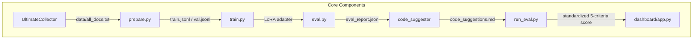

# UltimateDocResearcher Code Review Report

## Project Overview
The project is an autonomous AI research pipeline that collects documents → generates Q&A training pairs → fine-tunes an LLM → evaluates quality → produces code suggestions. The architecture is clean and well-decomposed into 7 distinct modules:

The unified LLM client (`llm_client.py`) routes between OpenAI, Anthropic, and local Ollama with an auto-detect fallback, making the system uniquely accessible across cost tiers.

---

## 🛤️ Phase Completion Status

| Phase | Name | Status | Notes |
| :--- | :--- | :--- | :--- |
| 1 | UltimateCollector | ✅ Shipped | PDF, Web, Reddit, GitHub, Drive |
| 2 | Remote Kaggle Execution | ✅ Shipped | `trigger_kaggle.py`, `poll_results.py` |
| 3 | Research Program Templates | ✅ Shipped | 4 built-in programs |
| 4 | Integration & Polish | 🔄 In Progress | Missing: `demo.ipynb`, `pyproject.toml`, `pytest CI`, `results_viz.ipynb` |
| 5 | Eval + Code Suggestions | ✅ Shipped | LLM Judge, `code_suggester`, unified LLM client |
| 6 | Dashboard + Memory | ✅ Shipped | Streamlit, SQLite, `PromptCache` |
| 7 | Advanced Features | 🚀 Planned | Ensemble, reward model, streaming dashboard |

---

## 🔍 Module-by-Module Code Review

### 1. `collector/ultimate_collector.py` — ⭐ 7.5/10

**Strengths:**
- Clean multi-source orchestration (PDF, Web, Drive, GitHub) via sequential `collect()` calls.
- Smart personal-folder warning to protect user privacy.
- Deduplication via SHA-1 of (title, url) — prevents corpus contamination.
- Metadata sidecar (`metadata.jsonl`) alongside main corpus is excellent design.

**Issues Found:**
| Severity | Issue |
| :--- | :--- |
| 🟡 Medium | **In-memory aggregation**: All docs accumulate in a Python list before writing. For large corpora, this risks OOM. Streaming writes to disk would be safer. |
| 🟡 Medium | **No retry mechanism**: Failed network requests are logged but silently dropped. A simple `tenacity` retry decorator would improve completeness. |
| 🟡 Medium | **JS-rendered pages fail silently**: BeautifulSoup + regex HTML parsing can't handle JavaScript-rendered SPAs. |
| 🟢 Minor | **Heuristic personal-folder detection**: Uses hardcoded strings (downloads, desktop). Cross-platform non-standard paths are missed. |

---

### 2. `collector/scraper.py` — ⭐ 7/10

**Strengths:**
- Clean async architecture with `aiohttp`.
- Synchronous `scrape_topic()` wrapper is convenient for Jupyter use.
- GitHub, Reddit, and Google CSE scrapers all in one file.

> [!CAUTION]
> **Critical Bug in `scrape_topic()` (line ~90):**
> `return asyncio.run(_run())` will throw a `RuntimeError` if called from an existing async context (Jupyter, FastAPI).
> **Fix**: Use `nest_asyncio` or check if the loop is running and use `loop.run_until_complete()`.

**Other Issues:**
| Severity | Issue |
| :--- | :--- |
| 🟡 Medium | **No rate limiting**: Rapid-fire requests to Reddit/GitHub/Google will trigger 429s. |
| 🟡 Medium | **Hardcoded text truncation**: Web pages cut at 8,000 chars, Reddit at 4,000. |
| 🟡 Medium | **Reddit without OAuth**: Public JSON endpoint may rate-limit aggressively. |
| 🟢 Minor | **GitHub search limitations**: Returns only owner/repo strings — no actual file fetching in `scrape_topic()`. |

---

### 3. `autoresearch/train.py` — ⭐ 8/10

**Strengths:**
- Excellent dual-backend design: Unsloth (fast) → HuggingFace PEFT (fallback) → CPU smoke-test.
- Comprehensive `research_loop()` orchestrator.
- Smart chat template fallback in `_load_dataset`.
- LoRA config covers all standard projection layers.

**Issues Found:**
| Severity | Issue |
| :--- | :--- |
| 🟡 Medium | **ML deps commented out**: requirements.txt has ML deps commented, leading to ImportErrors for local GPU users. |
| 🟡 Medium | **No early stopping/checkpointing**: If a kernel times out mid-loop, all progress is lost. |
| 🟢 Minor | **Git commit silent failure**: `_git_commit_results()` fails silently if no remote origin exists. |

---

### 4. `autoresearch/llm_client.py` — ⭐ 8/10

**Strengths:**
- Elegant `parse_model()` handles Ollama, Anthropic, OpenAI via a single string.
- `best_available_model()` auto-detection is an outstanding UX feature.
- Exponential backoff retry implemented.
- `urllib` fallback for SDK-less environments.

**Issues Found:**
| Severity | Issue |
| :--- | :--- |
| 🟡 Medium | **Global cache state**: `_cache_instance = False` is a code smell. Shared mutable state makes testing difficult. |
| 🟡 Medium | **Silent cache failure**: `except Exception: pass` in cache operations hides production bugs. |
| 🟡 Medium | **Maintenance burden**: Dual-path (SDK vs `urllib`) for the same API adds complexity. |
| 🟢 Minor | **Docstring Typo**: "claude-opus-4-6" appears to be a placeholder/typo. |

---

### 5. `autoresearch/eval.py` — ⭐ 8/10

**Strengths:**
- 3-axis scoring (Accuracy 40%, Relevance 35%, Completeness 25%).
- Heuristic fallback via word-overlap ensures resilience.
- Clean dataclasses with typed fields.
- Per-sample worst-3 reporting for gap detection.

**Issues Found:**
| Severity | Issue |
| :--- | :--- |
| 🟢 Minor | **Empty results handling**: If all LLM calls fail, results are empty with no indication of why. |
| 🟢 Minor | **Statistical significance**: `judge_pass_rate` lacks warning when `max_samples` is low. |

---

### 6. `autoresearch/prepare.py` — ⭐ 7/10

**Strengths:**
- 3-tier Q&A generation (NotebookLM → LLM → Heuristic).
- Auto-fallback chain ensures continuous operation.
- `program.md` injection into training context.

**Issues Found:**
| Severity | Issue |
| :--- | :--- |
| 🔴 High | **Fragile dependency**: NotebookLM uses an unofficial API (`notebooklm-py`) which may break. |
| 🟡 Medium | **Output parsing**: `_parse_qa` relies strictly on `Q: / A:` format. Fallback may drop valid pairs. |
| 🟡 Medium | **Context matching**: Best-effort keyword match for NotebookLM may associate questions to wrong chunks. |
| 🟢 Minor | **Global capping**: `max_pairs` applied after generation; more efficient to cap during generation. |

---

### 7. `autoresearch/code_suggester.py` — ⭐ 7/10

**Strengths:**
- Clear 3-step pipeline: analyze → translate → document.
- Intelligent corpus sampling (beginning + middle + end).
- Heuristic fallback extracts code blocks + generates stubs.

**Issues Found:**
| Severity | Issue |
| :--- | :--- |
| 🟡 Medium | **Duplicate import**: `from autoresearch.llm_client import chat` called twice inside `_call_llm()`. |
| 🟡 Medium | **Hardcoded Window**: `CORPUS_WINDOW = 12000` is conservative for modern LLMs. |
| 🟡 Medium | **Hardcoded Hints**: `domain_hints` doesn't cover new research topics dynamically. |

---

### 8. `eval/run_eval.py` — ⭐ 7.5/10

**Strengths:**
- Clean 5-criteria eval framework, CI-friendly exit codes.
- Weighted average scoring.
- Batch support (`--input results/*.md`).

**Issues Found:**
| Severity | Issue |
| :--- | :--- |
| 🟡 Medium | **Hand-rolled YAML parser**: `_minimal_yaml_load` is fragile. `pyyaml` should be a dependency. |
| 🟢 Minor | **Score parsing regex**: `re.search(r'(\d)\D', raw)` may grab incorrect numbers from reasoning. |

---

### 9. `memory/memory.py` — ⭐ 8.5/10

**Strengths:**
- Pure-Python TF cosine similarity (portable).
- SQLite WAL mode for thread safety.
- Well-indexed schema.

**Issues Found:**
| Severity | Issue |
| :--- | :---|
| 🟢 Minor | **IDF missing**: Implementation only computes TF. IDF would improve discrimination. |
| 🟢 Minor | **No TTL**: Old runs accumulate forever. |
| 🟢 Minor | **Maintenance**: Missing `VACUUM` support. |

---

### 10. `memory/cache.py` — ⭐ 7/10

**Strengths:**
- Dual lookup (exact SHA-1 + fuzzy cosine similarity).
- Hit counting and model-scoped lookups.

**Issues Found:**
| Severity | Issue |
| :--- | :--- |
| 🟡 Medium | **I/O Efficiency**: JSONL full-rewrite on every hit is O(n) I/O. |
| 🟡 Medium | **Hash Space**: SHA-1 truncated to 64-bit. SHA-256 preferred. |
| 🟢 Minor | **Matching strategy**: Fuzzy matching uses TF; embeddings would be superior. |

---

### 11. `dashboard/app.py` — ⭐ 8/10

**Strengths:**
- 4 well-organized views.
- Live data integration.
- Similarity check before new runs.

**Issues Found:**
| Severity | Issue |
| :--- | :--- |
| 🟢 Minor | **Missing deps**: `pandas` not in requirements.txt. |
| 🟢 Minor | **No Authentication**: Risks if deployed remotely. |

---

### 12. `Dockerfile` — ⭐ 6.5/10

**Issues Found:**
| Severity | Issue |
| :--- | :--- |
| 🔴 High | **Root user**: Violates security best practices. |
| 🟡 Medium | **Missing declarations**: No `EXPOSE 8501`. |
| 🟡 Medium | **No .dockerignore**: Includes data, results, .git, and DBs in the image. |

---

### 13. `.github/workflows/research.yml` — ⭐ 7.5/10

**Issues Found:**
| Severity | Issue |
| :--- | :--- |
| 🟡 Medium | **Polling Timeout**: 5 minutes is too short for ML training. |
| 🟡 Medium | **Quality Gates**: Missing linting/testing step. |

---

## 📦 requirements.txt Audit

| Package | Status | Issue |
| :--- | :--- | :--- |
| `aiohttp` | ✅ | |
| `anthropic` | ❌ | Missing from file |
| `streamlit` | ❌ | Missing from file |
| `pyyaml` | ❌ | Missing from file |
| `notebooklm-py` | ❌ | Missing from file |
| ML Deps | ⚠️ | Commented out; confusing for local users |

---

## 📄 Documentation Review

| Document | Quality | Notes |
| :--- | :--- | :--- |
| `README.md` | ⭐ 9/10 | Excellent architecture and guides. |
| `AGENTS.md` | ⭐ 8.5/10 | Detailed phase plans and benchmarks. |
| `eval/eval_spec.yaml` | ⭐ 9/10 | Self-documenting with weight rationale. |
| `CONTRIBUTING.md` | ❌ | Missing |
| `SECURITY.md` | ❌ | Missing |
| `.env.example` | ❌ | Missing |

---

## 📊 Final Ratings

| Dimension | Score |
| :--- | :--- |
| 🏗️ Architecture | 8.5/10 |
| 💻 Code Quality | 7.5/10 |
| 📄 Documentation | 8.0/10 |
| 🧪 Test Coverage | 2.0/10 |
| 🔒 Security | 6.0/10 |
| 🎯 Overall | **🟡 7.2 / 10** |

---

## 🎯 Top Priority Recommendations

1.  **Critical Fixes**:
    - Patch `asyncio.run()` in `scraper.py`.
    - Secure `Dockerfile` with a non-root user.
    - Complete `requirements.txt` with missing dependencies.
2.  **Phase 4 Priorities**:
    - Implement `pytest` suite for core logic.
    - Adjust Kaggle CI polling timeout.
    - Optimize cache I/O to use SQLite for counters.
