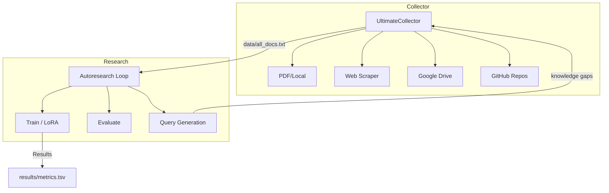

## Architecture



## 🚀 Quick Start

### 1. Local Setup
```bash
# Clone & install
git clone https://github.com/Amitro123/UltimateDocResearcher
cd ultimate-doc-researcher
pip install -r requirements.txt

# Run a mock research cycle
python collector/run_mock.py --topic "AI engineering"
```

### 2. Collect documents

```bash
# Scrape web + reddit + GitHub on a topic
python -m collector.ultimate_collector \
  --queries "Claude prompt engineering" "LoRA fine-tuning best practices" \
  --reddit MachineLearning LocalLLaMA \
  --github karpathy/autoresearch \
  --output-dir data/

# Or include local PDFs
python -m collector.ultimate_collector \
  --pdf-dir papers/ \
  --queries "transformer architecture" \
  --output-dir data/
```

### 3. Prepare training data

```bash
python autoresearch/prepare.py \
  --corpus data/all_docs_cleaned.txt \
  --output-dir data/ \
  --max-pairs 500
```

### 4. Train on Kaggle (remote, no local GPU)

```bash
# Set required secrets
export KAGGLE_USERNAME=your_username
export KAGGLE_KEY=your_api_key
export GITHUB_TOKEN=ghp_...

python api-triggers/trigger_kaggle.py \
  --topic "Claude skills optimization" \
  --iterations 20 \
  --github-repo yourusername/ultimate-doc-researcher \
  --download-results
```

### 5. Or trigger via GitHub Actions

```bash
gh workflow run research.yml \
  -f topic="Claude skills optimization" \
  -f iterations=20
```

Then watch: **Actions → UltimateDocResearcher → Run #N**

---

## Project Structure

```
ultimate-doc-researcher/
├── collector/
│   ├── ultimate_collector.py   # Main orchestrator
│   ├── scraper.py              # Async web/reddit/github scraper
│   ├── drive_extractor.py      # Google Drive + Colab/Kaggle mounts
│   └── analyzer.py             # Quality filter, chunking, dedup
├── autoresearch/
│   ├── prepare.py              # Q&A generation from corpus
│   └── train.py                # LoRA training loop + results.tsv
├── templates/
│   ├── program.md              # Active research program
│   └── program_templates.py    # 4 built-in programs + generator
├── api-triggers/
│   ├── trigger_kaggle.py       # Push/poll/download Kaggle kernels
│   └── poll_results.py         # Results polling + git sync
├── .github/
│   └── workflows/
│       └── research.yml        # GitHub Actions (dispatch + cron)
├── results/
│   └── results.tsv             # val_score per iteration
├── demo/
│   └── demo.ipynb              # End-to-end walkthrough
├── AGENTS.md                   # Phase plans + architecture notes
├── Dockerfile                  # Local dev container
└── requirements.txt
```

---

## Configuration

### Environment Variables

| Variable | Required | Description |
|----------|----------|-------------|
| `KAGGLE_USERNAME` | For remote training | Kaggle username |
| `KAGGLE_API_TOKEN` | For remote training | Kaggle API token |
| `GITHUB_TOKEN` | For result commits | GitHub PAT |
| `OPENAI_API_KEY` | Optional | Better Q&A generation in prepare.py |
| `GOOGLE_API_KEY` | Optional | Google Custom Search |
| `GOOGLE_CX` | Optional | Google CSE engine ID |
| `GDRIVE_SA_KEY_PATH` | Optional | Service account JSON for Drive |
| `GITHUB_TOKEN` | Optional | Higher GitHub API rate limits |

### Research Programs

```bash
# List available programs
python templates/program_templates.py --list
# claude-skills-optimizer
# mcp-agent-orchestration
# openclaw-production
# local-llm-fine-tuning

# Switch active program
python templates/program_templates.py \
  --program mcp-agent-orchestration \
  --output templates/program.md
```

---

## Results Format

`results/results.tsv` — tab-separated, one row per training iteration:

| Column | Description |
|--------|-------------|
| `iteration` | Loop counter (1..N) |
| `train_loss` | Training cross-entropy loss |
| `val_loss` | Validation loss |
| `val_score` | Normalised score 0–1 (higher = better) |
| `train_samples` | Number of training Q&A pairs |
| `elapsed_seconds` | Wall-clock training time |
| `topic` | Research topic |
| `timestamp` | ISO UTC timestamp |

---

## Docker (local dev)

```bash
docker build -t ultimate-doc-researcher .

docker run --rm \
  -v $(pwd)/data:/app/data \
  -e GOOGLE_API_KEY=$GOOGLE_API_KEY \
  ultimate-doc-researcher \
  --queries "Claude skills" --reddit MachineLearning
```

---

## Roadmap

- [x] Phase 1: UltimateCollector (PDF/web/Drive/GitHub)
- [x] Phase 2: Remote Kaggle execution + GitHub Actions
- [x] Phase 3: Research program templates
- [ ] Phase 4: End-to-end CI tests
- [ ] Phase 5: Iterative corpus expansion (gap-driven re-collection)
- [ ] Phase 5: Multi-model ensemble with mergekit
- [ ] Phase 5: Streaming results dashboard

See [AGENTS.md](AGENTS.md) for detailed phase plans.

---

## License

MIT — fork freely, build cool stuff.
