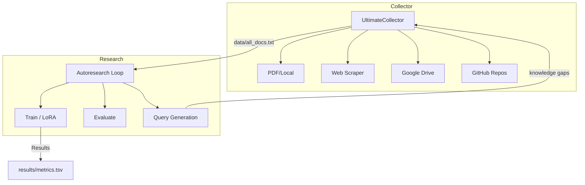

## 2-minute start

No API key. No Ollama. No GPU. Just Python 3.10+.

```bash
git clone https://github.com/Amitro123/UltimateDocResearcher
cd ultimate-doc-researcher
pip install -r requirements.txt
make quickstart
```

Opens the dashboard automatically when done. For the full Docker stack
(Ollama + Streamlit + all services in one command):

```bash
make docker-up   # then open http://localhost:8501
```

See [`quickstart/README_quickstart.md`](quickstart/README_quickstart.md) for
troubleshooting and the path from demo → your own research topic.

---

## Architecture



## 🚀 Quick Start

### 0. Reset workspace (required before each new topic)

```bash
# Archives papers/, clears stale data/, resets prompt cache, updates topic
python new_run.py --topic "your research topic"

# Dry-run first to see what would change
python new_run.py --topic "your research topic" --dry-run

# Keep the prompt cache when retrying a failed run (avoids redundant API calls)
python new_run.py --topic "your research topic" --keep-cache
```

> ⚠️ **Always run `new_run.py` first.** Skipping it causes corpus contamination
> from previous runs (old PDFs, stale data files, cached LLM responses).

### Test matrix — what works without setup

| Scenario | Status | Notes |
|----------|--------|-------|
| No Ollama, no API key | ✅ works | Heuristic mode — lower quality output |
| No API key, Ollama installed | ✅ works | Full quality, free |
| API key only (no Ollama) | ✅ works | Gemini / Claude / OpenAI |
| Fresh clone + `make quickstart` | ✅ works | Built-in demo corpus, no downloads |
| Docker: `make docker-up` | ✅ works | Full stack, model pulled automatically |

### 1. Local Setup
```bash
# Clone & install
git clone https://github.com/Amitro123/UltimateDocResearcher
cd ultimate-doc-researcher
pip install -r requirements.txt
```

### 2. Collect documents

```bash
# Scrape web + reddit + GitHub on a topic
python -m collector.ultimate_collector \
  --queries "Claude prompt engineering" "LoRA fine-tuning best practices" \
  --reddit MachineLearning LocalLLaMA \
  --github karpathy/autoresearch \
  --output-dir data/

# Or include local PDFs
python -m collector.ultimate_collector \
  --pdf-dir papers/ \
  --queries "transformer architecture" \
  --output-dir data/
```

### 3. Prepare training data

```bash
python autoresearch/prepare.py \
  --corpus data/all_docs_cleaned.txt \
  --output-dir data/ \
  --max-pairs 500
```

### 4a. Choose your LLM (OpenAI / Anthropic / Ollama)

All modules that call an LLM (`eval.py`, `code_suggester.py`, `prepare.py`) share the same model-string convention:

| Model string | Provider | Cost |
|---|---|---|
| `gpt-4o-mini` | OpenAI (`OPENAI_API_KEY`) | ~$0.15/1M tokens |
| `claude-3-5-haiku-20241022` | Anthropic (`ANTHROPIC_API_KEY`) | ~$0.25/1M tokens |
| `gemini-2.5-flash-lite` | Google Gemini (`GOOGLE_API_KEY`) | Free tier available |
| `gemini-1.5-flash` | Google Gemini (`GOOGLE_API_KEY`) | Free tier available |
| `ollama:llama3.2` | Local Ollama | **Free** |
| `ollama:mistral@http://host:11434` | Remote Ollama | **Free** |

**Setting up Ollama (free, runs locally, no API key needed):**

```bash
# 1. Install Ollama
# macOS/Linux:
curl -fsSL https://ollama.com/install.sh | sh
# Windows: https://ollama.com/download

# 2. Pull a model (one-time download, ~2GB for llama3.2)
ollama pull llama3.2       # recommended — fast + good quality
ollama pull mistral        # alternative
ollama pull phi4           # smallest / fastest

# 3. Verify it's reachable
python -m autoresearch.llm_client check

# 4. Test a quick prompt
python -m autoresearch.llm_client chat \
  --model ollama:llama3.2 \
  --prompt "Explain LoRA fine-tuning in one sentence."

# 5. Auto-detect best available model (Ollama → Anthropic → OpenAI)
python -m autoresearch.llm_client auto
```

### 4b. Evaluate with LLM-as-a-Judge

After preparing data (or after training), run the judge to score your val set:

```bash
# Free — local Ollama
python -m autoresearch.eval \
  --val-path data/val.jsonl \
  --judge-model ollama:llama3.2 \
  --max-samples 50

# OpenAI
python -m autoresearch.eval \
  --val-path data/val.jsonl \
  --judge-model gpt-4o-mini \
  --max-samples 50

# Anthropic Claude
python -m autoresearch.eval \
  --val-path data/val.jsonl \
  --judge-model claude-3-5-haiku-20241022 \
  --max-samples 50

# Point at a trained model for end-to-end eval
python -m autoresearch.eval \
  --val-path data/val.jsonl \
  --model-path models/lora_adapter \
  --judge-model ollama:llama3.2
```

Output: `results/eval_report.json` with per-sample scores + summary.

### 4c. Generate code suggestions from research corpus

After collecting and cleaning your corpus, generate ready-to-use Python snippets:

```bash
# Free — local Ollama
python -m autoresearch.code_suggester \
  --corpus data/all_docs_cleaned.txt \
  --model ollama:llama3.2 \
  --n-suggestions 5

# Or with a cloud provider
python -m autoresearch.code_suggester \
  --corpus data/all_docs_cleaned.txt \
  --model claude-3-5-haiku-20241022 \
  --n-suggestions 5
```

Output: `results/code_suggestions.md` — copy-paste Python code examples derived from your research topic. If your corpus covers Claude tool use, you get annotated SDK snippets. LoRA fine-tuning corpus → training loop examples. Etc.

### 4d. Score output quality with the standardized eval framework

After generating code suggestions (or any research output), score it against
the 5-criteria spec:

```bash
python -m eval.run_eval \
  --input results/code_suggestions.md \
  --judge ollama:llama3.2 \
  --threshold 3.5 \
  --output results/eval-report.json
```

Exit code `0` = pass, `1` = fail — safe to use in CI pipelines.

### 5. Train on Kaggle (remote, no local GPU)

```bash
# Set required secrets
export KAGGLE_USERNAME=your_username
export KAGGLE_KEY=your_api_key
export GITHUB_TOKEN=ghp_...

python api-triggers/trigger_kaggle.py \
  --topic "Claude skills optimization" \
  --iterations 20 \
  --github-repo yourusername/ultimate-doc-researcher \
  --download-results
```

### 6. Or trigger via GitHub Actions

```bash
gh workflow run research.yml \
  -f topic="Claude skills optimization" \
  -f iterations=20
```

Then watch: **Actions → UltimateDocResearcher → Run #N**

---

## Dashboard & Memory System

### Launch the dashboard

```bash
pip install streamlit pandas
streamlit run dashboard/app.py
```

Opens at `http://localhost:8501` with four views:

### Multi-Format Research Output (new)

Generate a structured package of research deliverables in one command:

```bash
python -m autoresearch.research --topic "multi-tenant RAG with Claude tool use"
```

Output: `results/multi-tenant-rag-with-claude-tool-use-<timestamp>/`

| File | Description |
|------|-------------|
| `SUMMARY.md` | Executive overview + key findings |
| `ARCHITECTURE.md` | System design, component diagram, trade-offs |
| `IMPLEMENTATION.md` | Step-by-step plan with code patterns & pitfalls |
| `RISKS.md` | Risk register with likelihood/impact/mitigation table |
| `BENCHMARKS.md` | Comparison tables and performance numbers |
| `NEXT_STEPS.md` | Prioritised actions (this week / 1-4 weeks / 1-3 months) |
| `CODE/code_suggestions.md` | Copy-paste Python patterns (from code_suggester) |
| `metadata.json` | Run metadata, errors, corpus stats |

The system automatically classifies your topic into one of four research types and generates only the relevant deliverables:

- **`code`** — implementation-heavy topics → SUMMARY + IMPLEMENTATION + NEXT_STEPS + CODE
- **`arch`** — system design → SUMMARY + ARCHITECTURE + RISKS + NEXT_STEPS + CODE
- **`process`** — workflow/MLOps → SUMMARY + IMPLEMENTATION + RISKS + NEXT_STEPS + CODE
- **`market`** — surveys/comparisons → SUMMARY + BENCHMARKS + RISKS + NEXT_STEPS + CODE

```bash
# Full pipeline: collect → analyze → generate
python -m autoresearch.research \
  --topic "LLM evaluation frameworks" \
  --collect \
  --pdf-dir papers/ \
  --model gemini-2.5-flash-lite

# Skip code suggestions (faster)
python -m autoresearch.research --topic "RAG architecture" --no-code

# View packages in the dashboard
streamlit run dashboard/app.py  # → Research Packages tab
```

### Research Chat (new)

```bash
streamlit run chat/app.py
```

Opens at `http://localhost:8501` — enter a topic, upload PDFs, add URLs,
and run the full pipeline interactively with live progress. Output tabs show
code suggestions, Q&A pairs, and raw logs. Similar past runs are flagged so
you can reuse cached results instead of re-running.

- **Recent Runs** — table of all runs with score/status, download links for `code_suggestions.md` and `eval-report.json`
- **Run Explorer** — drill into any run's per-iteration metrics with a val_score line chart
- **Metrics** — avg_score and pass_rate over time, score by topic bar chart
- **New Run** — topic input, similarity check against past runs, one-click launch

### Seed demo data (first-time setup)

```bash
python dashboard/seed_demo.py    # adds 8 realistic demo runs to runs.db
```

### How the memory system works

Every `research_loop()` call automatically:
1. Checks `dashboard/runs.db` for past runs with a similar topic (cosine similarity on TF-IDF)
2. Registers a new run row (`status=running`) at the start
3. Logs per-iteration metrics as they complete
4. Marks the run `completed` with final scores when done

```bash
# Skip if a similar run already exists (≥80% similarity)
python autoresearch/train.py \
  --topic "Building Claude skills" \
  --iterations 3 \
  --skip-if-similar

# Lower the threshold for stricter deduplication
python autoresearch/train.py \
  --topic "Claude SKILL.md optimization" \
  --similarity-threshold 0.6
```

### Prompt cache

The `PromptCache` stores LLM prompt→response pairs in `dashboard/cache/prompts.db` (SQLite), avoiding redundant API calls. Existing `prompts.jsonl` files are automatically migrated on first startup.

```python
from memory.cache import PromptCache

cache = PromptCache()
hit = cache.get_fuzzy("Explain LoRA fine-tuning", threshold=0.85)
if hit:
    response = hit["response"]
else:
    response = call_llm(...)
    cache.set("Explain LoRA fine-tuning", response, model="ollama:llama3.2")
```

> **Starting a new topic?** Run `python new_run.py --topic "..."` — this clears
> the cache automatically so stale responses from a previous topic don't bleed in.
> Use `--keep-cache` when *retrying* a failed run to avoid redundant API calls.

---

## Project Structure

```
ultimate-doc-researcher/
├── collector/
│   ├── ultimate_collector.py   # Main orchestrator
│   ├── scraper.py              # Async web/reddit/github scraper
│   ├── drive_extractor.py      # Google Drive + Colab/Kaggle mounts
│   └── analyzer.py             # Quality filter, chunking, dedup
├── autoresearch/
│   ├── prepare.py              # Q&A generation from corpus
│   ├── train.py                # LoRA training loop + results.tsv
│   ├── eval.py                 # LLM-as-a-Judge evaluator
│   ├── code_suggester.py       # Post-research code suggestion engine
│   └── llm_client.py           # Unified LLM router (OpenAI/Anthropic/Ollama)
├── eval/
│   ├── eval_spec.yaml          # 5-criteria evaluation spec with weights
│   ├── run_eval.py             # Standardized eval runner CLI
│   └── test_cases/             # Sample outputs for manual/CI testing
├── memory/
│   ├── memory.py               # SQLite run history + topic similarity search
│   └── cache.py                # Prompt cache (exact + fuzzy matching)
├── dashboard/
│   ├── app.py                  # Streamlit dashboard
│   ├── seed_demo.py            # Populate runs.db with demo data
│   ├── runs.db                 # SQLite run history (auto-created)
│   └── cache/
│       └── prompts.db          # Cached LLM prompt→response pairs (SQLite)
├── templates/
│   ├── program.md              # Active research program
│   └── program_templates.py    # 4 built-in programs + generator
├── api-triggers/
│   ├── trigger_kaggle.py       # Push/poll/download Kaggle kernels
│   └── poll_results.py         # Results polling + git sync
├── .github/
│   └── workflows/
│       └── research.yml        # GitHub Actions (dispatch + cron)
├── results/
│   └── results.tsv             # val_score per iteration
├── demo/
│   └── demo.ipynb              # End-to-end walkthrough
├── AGENTS.md                   # Phase plans + architecture notes
├── Dockerfile                  # Local dev container
└── requirements.txt
```

---

## Configuration

### Environment Variables

| Variable | Required | Description |
|----------|----------|-------------|
| `KAGGLE_USERNAME` | For remote training | Kaggle username |
| `KAGGLE_API_TOKEN` | For remote training | Kaggle API token |
| `GITHUB_TOKEN` | For result commits / higher rate limits | GitHub PAT |
| `OPENAI_API_KEY` | Optional | Q&A generation, LLM judge, code suggestions |
| `ANTHROPIC_API_KEY` | Optional | Claude as judge / code suggester |
| `GOOGLE_API_KEY` | Optional | Google Custom Search & Gemini LLM |
| `GOOGLE_CX` | Optional | Google CSE engine ID |
| `GDRIVE_SA_KEY_PATH` | Optional | Service account JSON for Drive |

### Research Programs

```bash
# List available programs
python templates/program_templates.py --list
# claude-skills-optimizer
# mcp-agent-orchestration
# openclaw-production
# local-llm-fine-tuning

# Switch active program
python templates/program_templates.py \
  --program mcp-agent-orchestration \
  --output templates/program.md
```

---

## Results Format

`results/results.tsv` — tab-separated, one row per training iteration:

| Column | Description |
|--------|-------------|
| `iteration` | Loop counter (1..N) |
| `train_loss` | Training cross-entropy loss |
| `val_loss` | Validation loss |
| `val_score` | Normalised score 0–1 (higher = better) |
| `train_samples` | Number of training Q&A pairs |
| `elapsed_seconds` | Wall-clock training time |
| `topic` | Research topic |
| `timestamp` | ISO UTC timestamp |
| `judge_pass_rate` | Fraction of val samples passing judge threshold (eval.py) |
| `judge_avg_score` | Mean overall judge score 1–5 (eval.py) |

`results/eval_report.json` — per-sample Q&A judge output (from `autoresearch/eval.py`, runs inside the training loop):

| Field | Description |
|-------|-------------|
| `summary.avg_overall` | Mean judge score across all val samples |
| `summary.avg_accuracy` | Mean accuracy score |
| `summary.avg_relevance` | Mean relevance score |
| `summary.avg_completeness` | Mean completeness score |
| `summary.pass_rate` | Fraction of samples ≥ threshold |
| `summary.worst_samples` | 3 lowest-scoring questions (corpus gap signals) |
| `samples[]` | Per-sample question, reference, model answer, scores |

`results/code_suggestions.md` — Markdown file with N Python code snippets derived from the research corpus.

`results/eval-report.json` — standardized 5-criteria output quality report (from `eval/run_eval.py`, run separately on any output file):

| Field | Description |
|-------|-------------|
| `summary.weighted_avg` | Weighted average score across 5 criteria |
| `summary.passed` | bool: weighted_avg ≥ threshold |
| `summary.criterion_scores` | Per-criterion scores (1–5) |
| `criteria[].reasoning` | Judge's one-sentence rationale per criterion |

---

## Standardized Eval Framework

Score any research output against 5 fixed criteria defined in `eval/eval_spec.yaml`:

| Criterion | Weight | What it checks |
|-----------|--------|---------------|
| Clarity | 2.0 | No ambiguity — rules are crystal clear |
| Completeness | 1.5 | 90%+ of corpus patterns covered |
| Actionability | 1.5 | Copy-paste ready, no boilerplate |
| Freshness | 1.0 | 2026 patterns, no deprecated APIs |
| Anti-patterns | 1.0 | Explicitly warns against common mistakes |

```bash
# Score any output (uses heuristic fallback if no LLM)
python -m eval.run_eval \
  --input results/code_suggestions.md \
  --judge ollama:llama3.2 \
  --threshold 3.5 \
  --output results/eval-report.json

# With Anthropic judge
python -m eval.run_eval \
  --input results/code_suggestions.md \
  --judge claude-3-5-haiku-20241022

# Batch — score multiple files
python -m eval.run_eval --input results/*.md --judge ollama:llama3.2
```

Exit code is `0` if all files pass, `1` if any fail — CI-friendly.

---

## Docker (local dev)

```bash
docker build -t ultimate-doc-researcher .

docker run --rm \
  -v $(pwd)/data:/app/data \
  -e GOOGLE_API_KEY=$GOOGLE_API_KEY \
  ultimate-doc-researcher \
  --queries "Claude skills" --reddit MachineLearning
```

---

## Troubleshooting

**Code suggestions reflect my own codebase, not external research**

This is the corpus contamination problem. It happens when your `papers/` folder contains internal project files (CODE_REVIEW.md, AGENTS.md, etc.) rather than external PDFs.

After collection, check `data/corpus_report.json` → `external_fraction`. If it's below 0.30, your corpus is mostly internal. Fix:

```bash
# 1. Reset workspace to clear stale data
python new_run.py --topic "your topic"

# 2. Add external PDFs — download papers and put them in papers/
python -m collector.ultimate_collector \
  --pdf-dir papers/ \
  --queries "your topic" \
  --output-dir data/

# 3. Check the fraction in the analyzer output:
# "External: N chunks (70%) | Internal: M chunks"
```

The analyzer now writes `data/external_docs.txt` separately. The code suggester uses 70% of its context window from that file and only 30% from the full corpus.

---

**Suggestions still truncate at the last item**

The default `--n-suggestions 5` uses `max_tokens = min(1500×5, 8192) = 7500`. If the model generates a verbose 6th suggestion beyond the 5 requested, it may clip. Use `--n-suggestions 4` for comfortable margin, or `--n-suggestions 6` to explicitly request 6 (budget becomes 8192, close to the Gemini free-tier output limit).

---

**`⚠️ CORPUS QUALITY WARNING: Only X% of chunks are from external sources`**

The analyzer detected that less than 30% of your corpus came from external sources. Add external PDFs or URLs. See "Code suggestions reflect my own codebase" above.

---

**Gemini 429 rate limit errors**

Free-tier Gemini keys hit per-minute quotas. The `llm_client` retries automatically with 15 s → 30 s → 60 s → 120 s backoff. You'll see `⚠️ Gemini rate limit … Retrying in Xs` — this is normal. If it keeps failing after 4 retries, wait 2–3 minutes before retrying the command.

---

**Mixed results from previous runs**

Always run `new_run.py` before starting a new topic. It archives `papers/`, clears `data/` artifacts, and deletes `dashboard/cache/prompts.db` so cached LLM responses from the old topic don't contaminate the new run. Use `--keep-cache` only when retrying a *failed* run on the same topic.

---

## Roadmap

- [x] Phase 1: UltimateCollector (PDF/web/Drive/GitHub)
- [x] Phase 2: Remote Kaggle execution + GitHub Actions
- [x] Phase 3: Research program templates
- [x] Phase 5: LLM-as-a-Judge eval (`eval.py`)
- [x] Phase 5: Post-research code suggestions (`code_suggester.py`)
- [x] Phase 5: Unified LLM client (Ollama / Anthropic / OpenAI)
- [x] Phase 5: NotebookLM Q&A backend for `prepare.py`
- [x] Phase 5: Standardized 5-criteria eval framework (`eval/`)
- [x] Phase 6: Streamlit dashboard (`dashboard/app.py`)
- [x] Phase 6: SQLite run history + topic similarity (`memory/memory.py`)
- [x] Phase 6: Prompt cache with fuzzy matching (`memory/cache.py`)
- [ ] Phase 7: End-to-end CI tests
- [ ] Phase 6: Iterative corpus expansion (gap-driven re-collection)
- [ ] Phase 6: Multi-model ensemble with mergekit
- [ ] Phase 6: Streaming results dashboard

See [AGENTS.md](AGENTS.md) for detailed phase plans.

---

## License

MIT — fork freely, build cool stuff.
